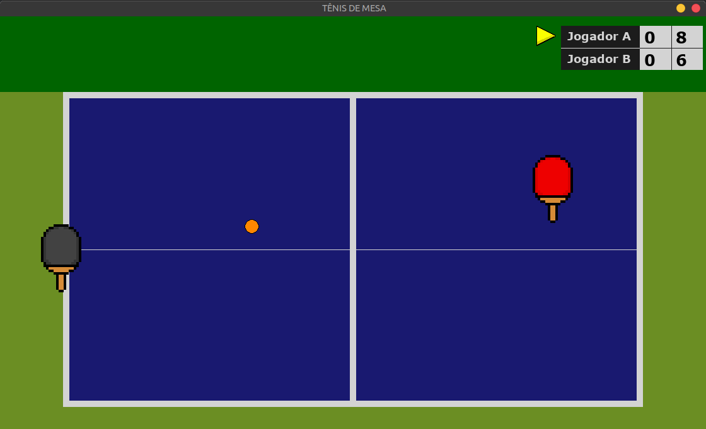
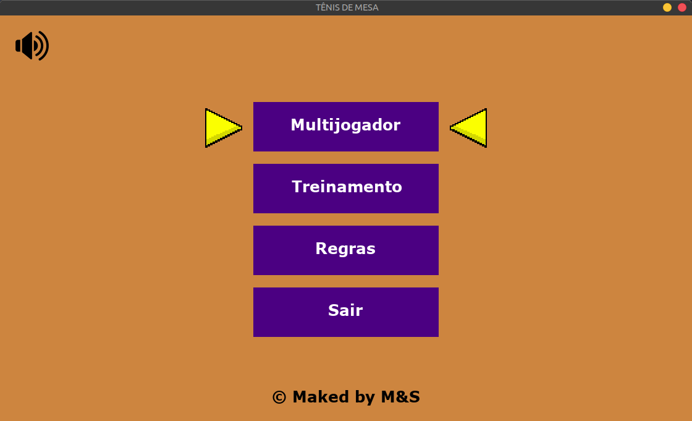

<h1 align="center">🏓 Tênis de mesa 🏓</h1>
 

### 📜 Requisitos:
* Python3
* Pip (Python Package Index)
* Biblioteca `pygame` instalada no PC

### 📝 Dependências:
    pip install -r requirements.txt
    
### ⬇️ Download e ✔️ Instalação:
Após instalar as dependências, clone o repositório em seu PC da maneira que preferir. Por exemplo, copie e cole a linha abaixo no seu programa padrão de linha de comando:
    
    git clone git@github.com:maxbarbosa/TableTennisPygame.git
   
<h1 align="center">Tela de Menu</h1>
 

# 🎮 Controles:
* Utilize as teclas ⬇️ e ⬆️ para selecionar a opção desejada na tela de menu usando a tecla `Enter`
* Utilize a tecla `ESC` para silenciar a música
* Utilize a tecla `TAB` para habilitar a música
* Para controlar o _Jogador A_, utilize as teclas 🇼, 🇦, 🇸, 🇩
* Para controlar o _Jogador B_, utilize as teclas ⬆️, ⬅️, ⬇️, ➡️
* Para posicionar a bolinha durante o saque utilize as teclas 🇹 e 🇬 
* Para retornar à tela de menu, utilize a tecla `ESC`

### ❌ Desinstalando:
Caso queira desinstalar o jogo de sua máquina, basta apenas excluir a pasta *TableTennisPygame*.
